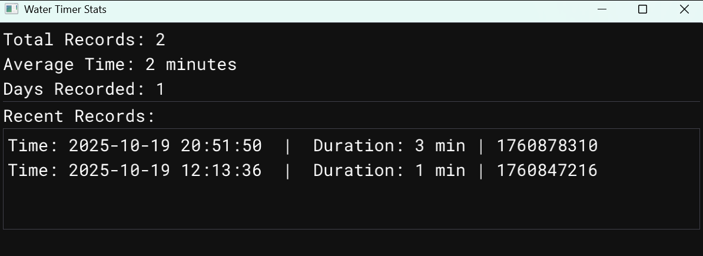

# water-timer

I needed a visualized timer to track how much time I spend coding each day, so I wrote this program. **SDL3** is used for screen interaction, and **ImGui** is used for data display.

## How to Use

Unzip the release files and double-click `run.bat` to execute it. If you directly click the executable (`.exe`), a console window will appear.

Due to SDL3, mouse input checks can sometimes be unreliable. As a result, you might need to click a button twice for it to register.

You can **click and drag the window with the left mouse button**. There are five buttons, described from left to right:

  * **1: Start Timer** - Click to start the timer. The **blue background disappears**, indicating the timer is running.
  * **2: Pause** - Click to pause. The **blue background appears**, indicating the timer is paused.
  * **3: Reset and Save** - Click to **reset the current timer to zero**, write the data to a JSON file, and enter the paused state.
  * **4: View Data** - Click to automatically run `visualizer.exe`, which reads the JSON file and displays the data.
  * **5: Exit** - Click to **exit the program**. This will also record the current data.

The water level updates every minute. The maximum duration is **6 hours** (if you code for more than 6 hours a day, does it mean a lot of it is copying and pasting? Even if not, 6 hours is a lot; perhaps you should spend more time elsewhere). Tick marks are displayed every half hour: the shorter marks represent half-hour intervals, and the longer marks represent full-hour intervals.

**Water Surface Timer:**

**Data Visualization Interface:** The date is in **UTF-8** format, representing the start time of the recorded session.

## Compilation Environment

I use the **2022 MSVC** compilation environment. I use `build.py` in the console to compile; you can inspect the contents of this Python file.

`python build.py all` compiles and runs everything.
