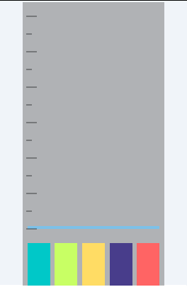
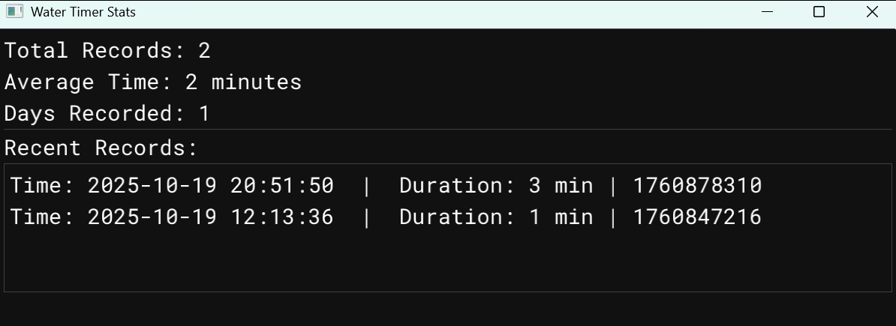

# water-timer

我需要一个可视化的计时器来看看我每天都花了多少时间在代码上,所以就写了这个程序,SDL3用于画面交互,ImGui用于展示数据

## 如何使用

解压release的文件双击`run.bat`运行,直接点击exe的话会有控制台

SDL3的原因鼠标检查有时候不灵,接下来点击按钮可能要点两次才识别到

鼠标可以左键点击拖动窗口,然后有五个按钮,从左到右依次介绍

- 1:点击开始计时,然后蓝色的背景消失,说明现在是计时状态
- 2:点击暂停,蓝色的背景出现说明现在是暂停状态
- 3:点击把当前计时器清0,将数据写入json文件,并进入暂停状态
- 4:点击会自动运行`visualizer.exe`,它读取json文件展示数据
- 5:点击退出程序,也会记录一次数据

然后水面每分钟更新一次,最多有6小时(如果一天写代码超过6小时那说明可能很多在复制粘贴?就算不是,6小时也已经很多了,也许应该花更多时间在别的地方),半小时展示一次刻度,短的为半小时级别长的为整数小时级别

水面计时器:

数据展示界面,其中日期是UTF+8,意思是这次记录开始的时间:

## 编译环境

我使用2022 MSVC的编译环境控制台使用`build.py`来编译,你可以看看这个python文件内部

`python build.py all`可以编译运行全部内容
